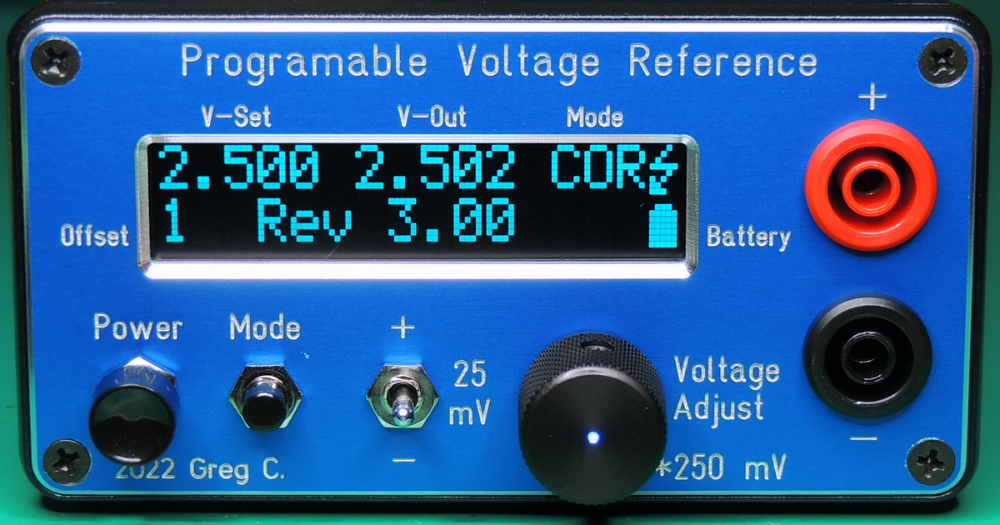
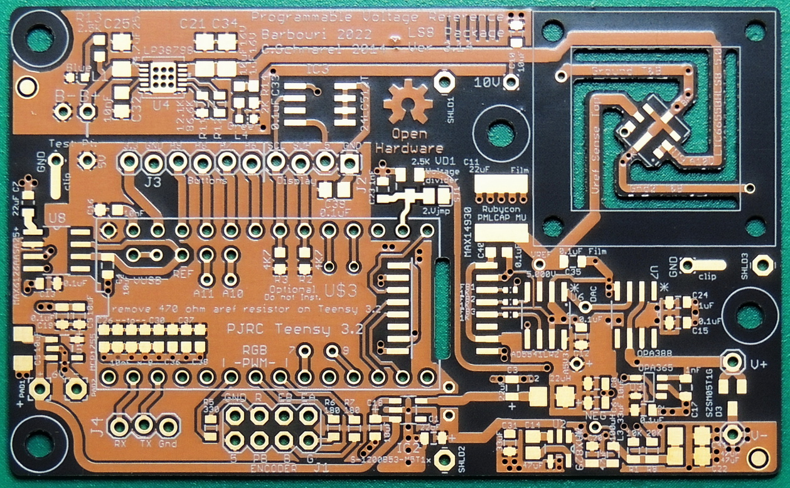
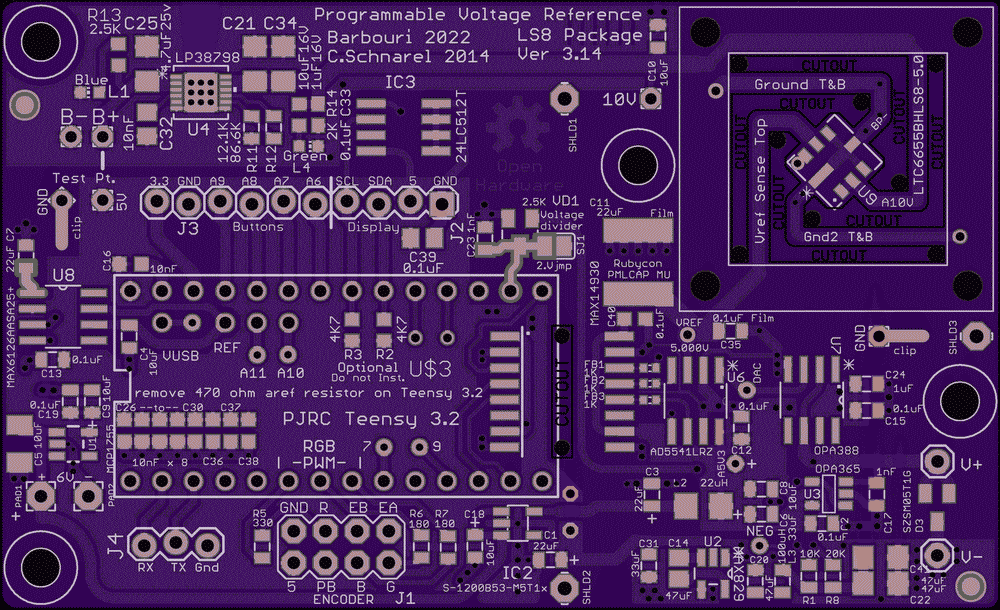

# Programmable-Voltage-Reference
An adjustable 0.001 to 5.000 volt reference, adjustable in 1 mV steps with display
==============================

This repository contains the design files and write-up for a Programmable Voltage Reference.  The reference has a range of 1 mV to 5.000 volts in 1 mV steps. The accuracy is plus or minus 50 uV for any set value. The reference value is displayed on a 2 X 16 character OLED display and can be set manually using the rotary encoder or remotely over the TTL serial to isolated USB 2.0 port.

The software folder contains an Arduino / Teensyduino sketch that is the source code for the voltage reference firmware.

Visit https://www.barbouri.com/2022/03/29/updating-the-programmable-voltage-reference-project/ for a more detailed explanation of the project design.

You can order this PCB directly from OSH Park.  Click on the following link.  
  * Programmable Voltage Reference V3.14- https://oshpark.com 3.14

See the Bill of Materials (BOM) file in the repo Hardware folder for a parts list.  

## Status  
  * Version 3.14 PCB has been tested to be functional.
  * Version 3.15 PCB is untested with changes to silkscreen values and circuit trace widths.

## File Formats  

Hardware design files are in "CadSoft EAGLE PCB Design Software 7.7" .brd and .sch formats.  A free version of the software can be downloaded from https://www.autodesk.com/products/eagle/free-download.

The example code is in Arduino / Teensyduino .ino format (text).  A free version of the Arduino software can be downloaded from www.arduino.cc.
Teensyduino software add-on for the Arduino IDE can be downloaded from https://www.pjrc.com/teensy/teensyduino.html

Front panel was fabricated by "Front Panel Express" using "Front Panel Designer". A free version of the software can be downloaded from https://www.frontpanelexpress.com/front-panel-designer/download

## Distribution License  

Original design by C. Schnarel 2014 https://github.com/uChip/VoltageReferenceProgrammable

License:
 Programmable Voltage Reference by <a xmlns:cc="http://creativecommons.org/ns#" href="https://github.com/Barbouri/Programmable-Voltage-Reference" property="cc:attributionName" rel="cc:attributionURL">G. Christenson 2022 / C.Schnarel 2014</a> is licensed under a <a rel="license" href="http://creativecommons.org/licenses/by-sa/4.0/">Creative Commons Attribution-ShareAlike 4.0 International License</a>.
  
